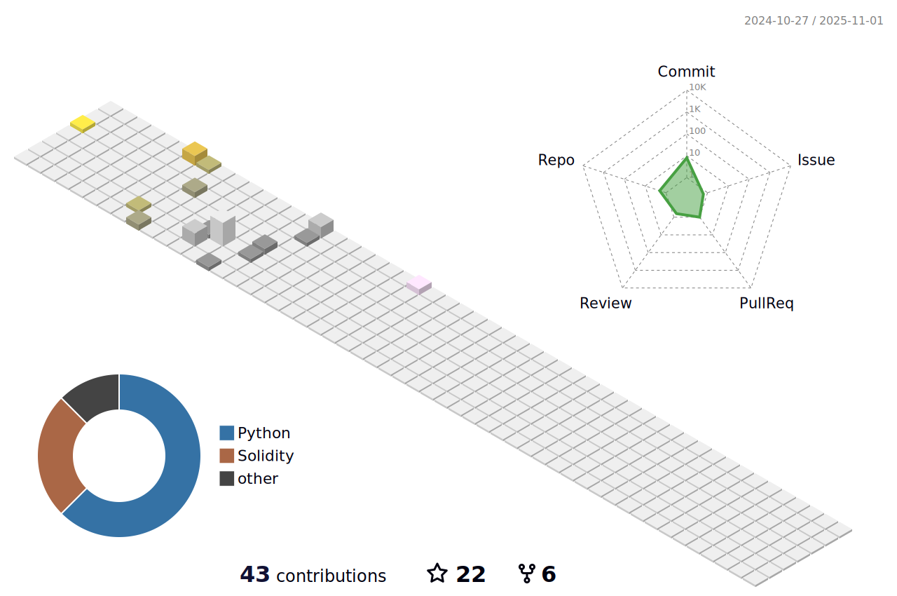
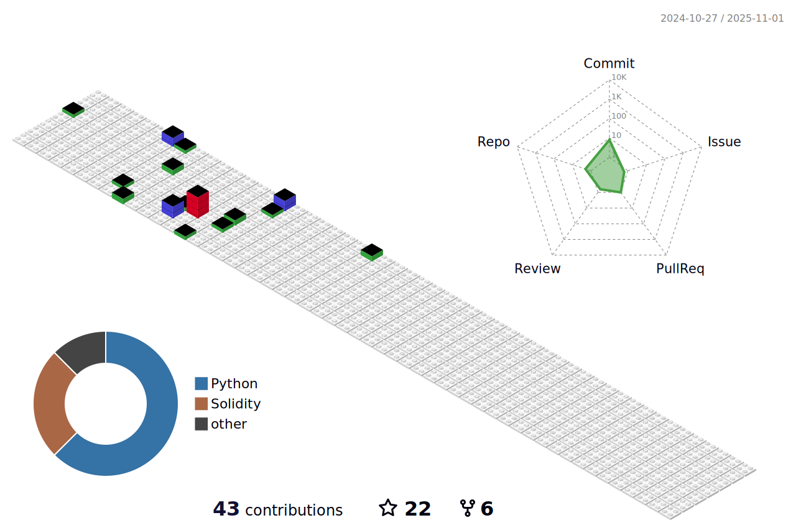

<!-- Visitors -->
<div>


  
<div align="center">

###### | [Jump to TODO <sub>private](https://github.com/catunderrain/TO-DO/blob/main/readme.md) | [TASKSDONE](https://github.com/catunderrain/TO-DO/blob/main/TASK_I_HAD_DONE.md) | [Jump to mainboard <sub>private](https://github.com/catunderrain/TO-DO/blob/main/MAINBOARD.MD) |
</div>
</div>

---
<!-- Intro GIF -->
<div align="center">


```python
if __name__ == '__main__':
  life = Continue(learn)
```
</div>

---
<details>
<summary>
  
###### ***Love Mochi ❤️***
</summary>
<!-- INTROs -->
<h3 align="center">
  <a href="https://git.io/typing-svg"></a>

  <a href="https://git.io/typing-svg"></a>
</h3>

<!-- INTRODUCTION -->
<div align="center">
<h3>🐇 My Contributions 🐇</h3>

<!-- Link to make svg file: https://platane.me/snk/ -->
<!--  -->
</div>

---
<!-- INTRO WORDS -->
<div align="center">
  
### :rabbit2: INTRODUCTION :rabbit2:
###### [🎹](https://wakatime.com/dashboard)
</div>

❤️ **Hi! My name is Toan, I'm from Viet Nam and I'm an AI learner.**
<br>✨ **With three years of in-depth research in machine learning, I aim to apply AI and machine learning to practical applications that assist humans, particularly in audio and image signal processing.**
<br>🔭 **My goal is to promote the development of machines that can operate artistically and academically alongside humans.**
<br>🎸 **I enjoy playing musical instruments, particularly the piano and guitar, and I have a keen interest in music and art.**
<br>🤔 **I am fasciknated by observing natural phenomena and understanding their changes.**
<br>📖 **I love reading literature, poetry, and science books, and I am intrigued by the mathematical formulas that underlie life.**
<br>🌱 **I am passionate about animals and plants.**
<br>🫂 **Additionally, I cherish my family and aspire to leverage technological advancements to enhance people's quality of life.**
<div align="center">
  
> **My nickname is:** Cat Under Rain, but you can call me Hinzu<br>
> **Contact me via github or email:** `catunderrainvn@gmail.com`

❤️**🐇It was a pleasure meeting you all and I hope we will progress together every day not only technically but also beyond** 🐇❤️

***My favorite quote:***<br>
**"Trí tuệ nhân tạo nghĩ gì khi tan biến?"**<sub>(vi)</sub>
*\- Shiro Akabane 6-21:20 -*

<!-- Visitcard -->
__\_\_ V i s i t c a r d \_\___
```
'''#------------------------------------------------#"""
|                                                      |
|      XXXX         X       XXXXXXXXX   X          X   |
|    XX    XX    XX   XX       XX       X X      X X   |
|   XX          XX     XX      XX       X   X  X   X   |
|   XX          XXXXXXXXX      XX       X  _    _  X   |
|    XX    XX   XX     XX      XX        X    _,   X   |
|      XXXX     XX     XX      XX        =====o=====   |
|                                                      |
|              HINZU & MOCHI PRESENTATION              |
'''#------------------------------------------------#"""
```
<!-- Linkedin -->
  <a href="https://linkedin.com/in/thaitoan" target="_blank">
    
  </a>

---
</div>

<!-- Frameworks - Tools - Languages -->
<h3 align="center">🐇 Frameworks - Tools - Languages 🐇</h3>
<div align="center">
    
    <br>
</div>

---
<!-- Stats -->

<h3 align="center">🐇 Stats 🐇</h3>
<div align="center">

<!-- [](https://github.com/ryo-ma/github-profile-trophy) -->
[](https://github.com/ryo-ma/github-profile-trophy)


<!--  -->

[](https://jrohit.com.np)<!-- https://github.com/Ashutosh00710/github-readme-activity-graph -->

[](https://git.io/streak-stats)


[](https://github.com/catunderrain/github-readme-stats)

[](https://github.com/catunderrain/github-readme-stats)

[](https://github.com/catunderrain/github-readme-stats)

[](https://github.com/catunderrain/catunderrain)
</div>

---
<!--My gangz-->
<h3 align="center">🐇 MY GANGZ 🐇</h3>
<div align="center">
<a href="https://git.io/typing-svg"></a>

🐇╔═════════════════════❤️═════════════════════╗🐇
######  **Mochi** <sub>*as*</sub> **Bánh Bao Mochi Kem** <sub>*-*</sub> **Dumpling Mochi Cream** <sub>*or*</sub> **Dump Mochi** 

######  **Hinzu** <sub>*as*</sub> **Mật Vụ Hinzu** <sub>*-*</sub> **Hinzu the Secret Agent** <sub>*or*</sub> **Gangzter Hinzu** 
🐇╚════════════════════════════════════════════╝🐇

<a href="https://git.io/typing-svg"></a>
</div>

---
<!-- Guardian -->
<h3 align="center">🐇 MY GUARDIAN 🐇</h3>


<div align="center">

`She will protect the codes of me, and you.`<br>
`So, just donate to her.`
</div>

---
<!-- Donation -->
<div align="center">

### :rabbit2: DONATION :rabbit2:
### <sup>**Click** -></sup> <sub><sub><sub><sub><sub>[](https://github.com/catunderrain/PULL-A-REQUEST-FOR-DONATION/tree/main)</sub></sub></sub></sub></sub> <sup><- Click</sup>

---
<!-- FAVORITEs -->
### :rabbit2: MY FAVORITE STUFFS :rabbit2:

[](#)
<br>S t y l e d C o m p o n e n t s : )

---
<!-- OUTTRO + GIF -->
<a href="https://git.io/typing-svg"></a>


**"** . I l o v e t h e r a i n . **"**

---
<!-- END -->
###### - END -
</div>
</details>


